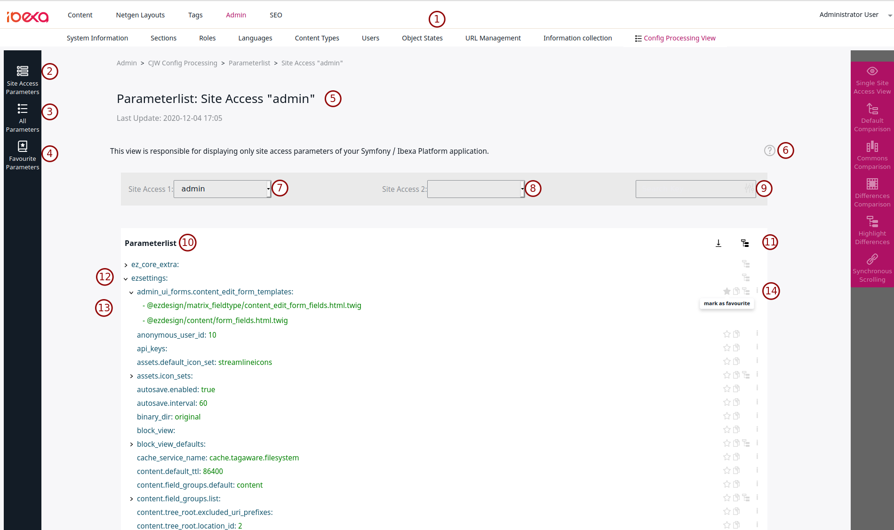

# Help Pages: "Parameterlist: Site Access ..."

This file is supposed to provide an overview over the
`Parameterlist: Site Access Parameters` - view.

# Page Overview:




## Elements:

Some elements displayed in the screenshot may vary from your view, but the overall structure,
purpose and functionality of the displayed elements will likely be the same in your version.

1. **Path to the bundle frontend**:
    In order to access the frontend this bundle provides, the user requires the eZ / Ibexa Platform Backoffice.
   The Backoffice contains certain tabs (which will likely vary based on your own configuration and additional bundles,
   here a standard netgen media site 2.0 setup is used), one of which is the `admin`tab. If the bundle has been 
   installed successfully, then there should be a `Config Processing View` under the admin tab, which leads directly
   into the view from above.

2. **Site Access Parameters**:
   This is a button on the left sidebar menu. If clicked, the user will be taken to the
   parameter view for the site access specific parameters, which is the view discussed in
   this help.

3. **All Parameters**:
   Another button on the left sidebar menu, which, when clicked, brings the user to a view
   of all parameters of the symfony application (without site access limitations).

4. **Favourite Parameters**:
   Is a button on the left sidebar menu, which, when clicked, takes the user to the
   view dedicated to the parameters marked as favourites by the user (this view only
   contains parameters, when the feature is enabled (check the bundle config)).

5. **The View-Header**:
   The View-Header is the uppermost, changing element on the page. It contains 3
   important items (from top to bottom):
   <br/>
    1. **The path**: The topmost element contains a rough overview of where you are
       in the frontend of the bundle (here: `Admin > CJW Config Processing > Parameterlist > Site Access "admin"`)

    2. **The headline**: It is the biggest element in the header, and it states what view
       or tab you are looking at in the bundle

    3. **Last update**: This element shows you when the displayed parameters have last been updated,
       meaning, if you updated the config, but the additions do not show up, it could be
       due to you looking at an outdated version of the page (refresh the page in that case)

6. **Help Teaser**:
   This is a short introductory sentence, meant to provide a quick overview over what
   the current view is for. At the right end of the teaser, the `show help` - button
   resides, which, when clicked, opens this help file in an overlay.

7. **Site Access Context Selection**:
    This control panel allows the selection of the site access context in which to view the parameters. Selecting
   a site access will lead to the parameters being rendered in the corresponding context.

8. **Site Access Compare Selection**:
    This control allows the user to select a second site access. Doing so will trigger the comparison view,
   in which the site access parameters will be rendered in the contexts of both selected site accesses at the
   same time, allowing the user to compare the values the parameters hold in these contexts (refer to
   the help for the comparison view for more details).

9. **Searchbar**:
   The searchbar allows a user to search for specific keys (or values, depending on the current
   `searchmode`). Simply enter text into the search-field and wait a short moment, as
   there is a small delay between your input, and the search starting, and then you
   should start seeing the results of your search.

    1. Next to the search-field itself, there is a button on the far right within the bar,
       clicking the button, will switch the search mode from key search to value search and vice
       versa.
    2. Another button will appear, when input is entered into the searchbar: An `X`. Clicking
       this button will clear the search input and reset the search.
    3. `search-mode`: The search mode dictates how the input search text is being handled:
       If the key search is active (default mode, indicated by a blue outline around the searchbar when in focus),
       only keys are searched, which fit the given search text. If the value search is active
       (indicated by a green outline around the bar), only values will be searched which match the
       given search input.
       
    ```
   Example searches (in key mode):
        ezsettings          (searches for "ezsettings" across all parameters)
        ez                  (searches for "ez" across all parameters)
        ezsettings.default  (searches for "ezsettings.default" across all parameters)
        ez.default.standard (searches for "ez.default.standard" across all parameters) 
    ``` 

10. **List-Header**:
   The list-header may vary depending on the view, but it typically contains a headline,
   which describes the beginning of the actual parameter-list and also global utility buttons
   (see 11 for more details).

11. **Global Utility Buttons**:
   There are usually two global utility buttons in the list header (always placed at the far right
   of the header).

    1. On the left there is the **download** button. This button will provide a file representation
       of the current parameter list which can be downloaded by the user.

    2. On the right there is the global **open subtree** button, which, when clicked,
       will open up every parameter in the entire list down to the last possible level. This
       is an asynchronous process, which means that it will take time until the process is complete,
       but the first results will show up immediately.

12. Example of a **Parameter (key)**:
   The parameter list is mostly made up of parameter keys (such as this one), as the different key
   segments are split and structured hierarchical to provide a human-readable and organized structure.
   The actual visual representation is made up of various parts, such as `utility buttons` (refer to 14),
   and the key itself, but on the very left there is a visual indicator, showing whether the key has been
   opened (pointing downwards) or closed (pointing to the key).

13. Example of a **Value**:
    This example includes the visual representation of a parameter value (colour green). As the value represents
    the lowest possible level of the hierarchical presentation of the parameters, there is no level beneath the
    value, and the value itself does not provide any additional functionality.

14. **Specific Utility Buttons**:
    Contrary to the `global utility buttons` (refer to 11), the specific buttons appear depending on the
    status the parameter (segment / key) holds: If the parameter key sits in the hierarchy and
    does not feature values in the next level, it will only contain:

    1. The **open subtree** button: Since when the key does not feature a value as its direct child,
       there are more levels of keys beneath it and thus the user has the option to open
       up the entirety of the subtree from that point by clicking the `open subtree` button.

    Otherwise, the keys will typically feature three buttons (from left to right):

    1. The **mark as favourite** button: This button is used to mark a parameter as a favourite.
       Marking a parameter will make it available in the dedicated favourites view (if the feature is enabled).
       The button will turn yellow once clicked, indicating that the process of favouring the parameter is running
       but not completed. Then it will turn green, if the process has been successful, or it will turn back to its
       former state if the process has failed.

    2. The **copy key** button: This button will copy the full name of the parameter (including every key segment
       up to the highest level) to clipboard. `There is an equivalent function for the location info!` (see the next
       button for more info).

    3. The **location info** button: This button (spouting an `i` on its front), retrieves info about
       what file a parameter and its value are from and displays that information on the key of the request. If the
       information is requested in a site access context, the actual site access origin of the parameter and value is
       given too. The paths to the files the parameter stems from are clickable and will copy the entire path
       to the clipboard of the user, when clicked.

